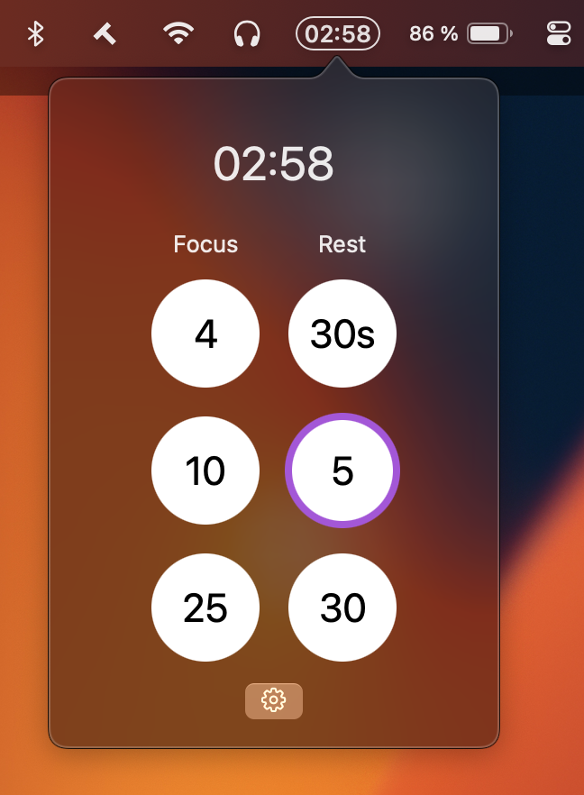

# CountdownTimerBar

Minimalist, hackable countdown timer for your macOS status bar. Built for coders, makers, and productivity geeks who want a Pomodoro-style timer always at hand — but hate bloat.



## Features

- ⚡️ **Instant access:** Start focus or rest timers with one click from your menu bar
- 🕒 **Configurable presets:** Set any combination of minutes and seconds (e.g. `25, 5m, 30s`)
- 🎨 **Distraction-free:** No Dock icon, no popups, no nags — just a clean pill timer in your status bar
- 🔔 **Native notifications & sound:** Get notified when your timer ends (toggle sound in options)
- 💾 **Remembers your settings:** All presets and options persist between launches
- 🌗 **Dark & light mode:** Looks great in any macOS theme

## Install

1. **Clone & build:**
   ```sh
   git clone https://github.com/Bazai/CountdownTimerBar.git
   open CountdownTimerBar/CountdownTimerBar.xcodeproj
   ```
2. **Build & run** in Xcode (Release or Debug)
3. **Or** [Download the latest release](https://github.com/yourusername/CountdownTimerBar/releases) and drag to Applications

> **Note:** First launch may require you to allow notifications in System Preferences.

## Usage

- Click the pill timer in your status bar to open the timer popover
- Click any preset to start a countdown (active timer is highlighted)
- Click the gear ⚙️ to open options:
  - Edit focus/rest presets (supports `10`, `30s`, `5m` etc)
  - Toggle sound on/off
  - Quit the app
- Timer ends? Get a native notification and (optionally) a sound

## Why?

- No bloated Pomodoro apps
- No Dock clutter
- No distractions
- Just a timer, always where you need it

## Contributing

PRs welcome! If you have an idea for a feature or spot a bug, open an issue or submit a pull request.

## License

MIT — do what you want, but don't blame me if you miss a meeting.
