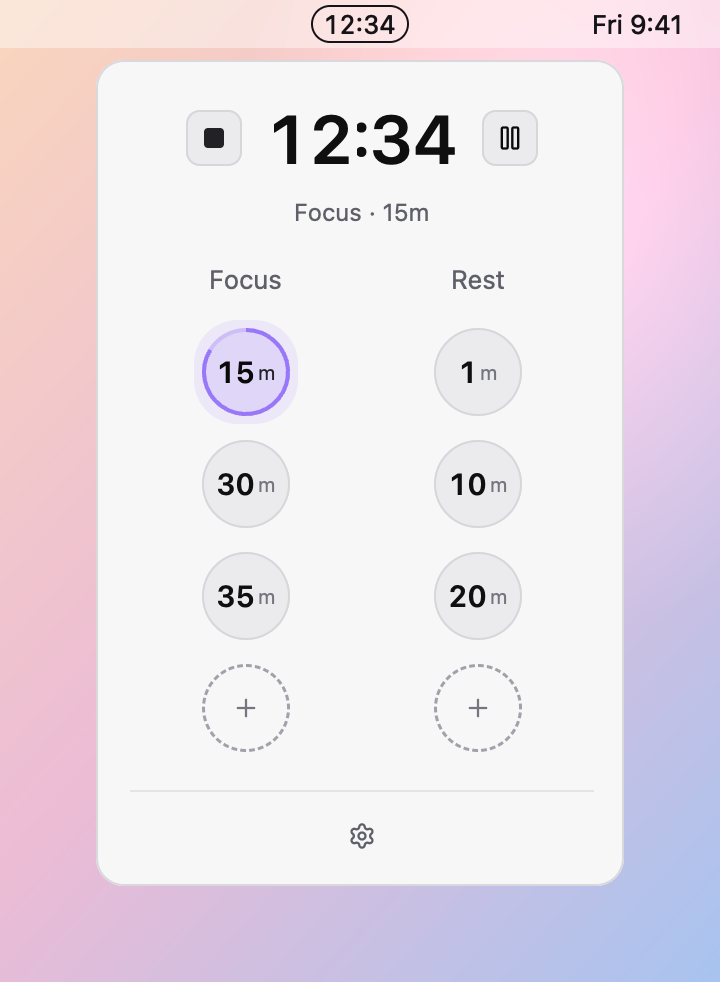

# CountdownTimerBar

[](https://github.com/Bazai/CountdownTimerBar/actions/workflows/ci.yml)
[](https://github.com/Bazai/CountdownTimerBar/releases)
[](LICENSE)


A minimalist, hackable countdown timer that lives in your macOS status bar. Click a preset and get back to work, and the time stays one glance away. Made for developers and makers who want a Pomodoro-style timer within reach and have no use for bloat.

<p align="center">
  <picture>
    <source media="(prefers-color-scheme: dark)" srcset=".github/hero-dark.png">
    
  </picture>
</p>

## Features

- ⚡️ **One click to start:** Pick a Focus or Rest preset in the popover; click it again to pause or resume
- ⏱ **The time where you look:** A pill in the menu bar counts down, and dims when paused
- 🎚 **Presets you can reshape in seconds:** Drag a circle up or down to adjust it, double-click or just type to set an exact value, add up to eight per column
- 🕒 **Minutes and seconds:** Write your own list, e.g. `25, 5m, 30s`
- 🟣 **A ring that shows what's left:** The running preset drains clockwise, once per second
- ⌨️ **Keyboard-first when you want it:** `Tab` through the circles, `Space` to start, `Enter` or a digit to edit, `↑`/`↓` to nudge, `Delete` to remove
- 🔔 **Native notification & sound:** Get told when time is up; the sound is optional
- 🎨 **Distraction-free:** No Dock icon, no windows, no nags
- 🌗 **Follows your Mac:** Dark and light, switching with the system
- 💾 **Remembers everything:** Presets and options persist between launches

## Install

**Download.** Get the latest build from [Releases](https://github.com/Bazai/CountdownTimerBar/releases), unzip it and drag `CountdownTimerBar.app` to Applications. Unless the release notes say otherwise, the app is unsigned. On first launch, right-click it and choose **Open**.

**Build it yourself.** You need macOS 15 or later and [mise](https://mise.jdx.dev):

```sh
git clone https://github.com/Bazai/CountdownTimerBar.git
cd CountdownTimerBar
mise install
make build        # creates releases/CountdownTimerBar.app
open releases/CountdownTimerBar.app
```

When the first timer finishes, macOS asks whether to allow notifications. If you said no, enable them in System Settings, under Notifications.

## Usage

- Click the pill in your status bar to open the popover.
- Click a preset to start it. Click the running one to pause it and click again to resume. The stop button ends the countdown.
- Drag a circle up or down to adjust it. Double-click it, or focus it and type digits, to enter an exact value. `m` and `s` switch between minutes and seconds.
- Hover a circle to show the × that removes it. The **+** button adds a new preset.
- Open the gear icon for the options:
  - Edit the Focus and Rest lists as text (`10`, `30s`, `5m`), which stays in sync with the circles.
  - Turn the sound on or off.
  - Open About, or quit with `⌘Q`.
- While a preset runs, you cannot edit or remove it, so you cannot lose a countdown by accident.

## Why another timer

- It lives in the menu bar and has no Dock icon.
- The whole interface is one popover.
- Presets are plain text that you can write by hand.
- The source is open under the MIT license.

## License

MIT. Do what you want, but don't blame me if you miss a meeting.

---

# For contributors and agents

PRs are welcome. If you have an idea or find a bug, open an issue or a pull request. The rest of this file is for people and AI agents who work on the code.

## Quick start

```sh
mise install       # Rust 1.98.1, pinned in mise.toml
cargo run          # run from the working tree
make check         # fmt check, clippy (-D warnings) and all tests; run before every commit
```

`cargo run` works without a bundle. Notifications need the bundled app (`make build`), because macOS requires a bundle identifier for them.

| Command | What it does |
| --- | --- |
| `make build` | Builds the release bundle `releases/CountdownTimerBar.app` (unsigned unless signing variables are set) |
| `make dist` | Runs `make build`, then writes `releases/CountdownTimerBar-v<version>.zip` for the GitHub release |
| `make license` | Sets the LICENSE years to `<first year>-<current year>`; the About card shows the same text |
| `make agents` | Links `.agents/skills` into `.claude/skills` and creates `CLAUDE.md` (`@AGENTS.md`) if it is missing |
| `make run` | Builds, stops a running copy and opens the new one |
| `make check` | Runs `fmt-check`, `lint` and `test` |
| `make release` | Tags `v<Cargo.toml version>` and pushes the branch and tag to `origin` (`DRY_RUN=1` to rehearse) |
| `make fmt` / `make lint` / `make test` | Run the parts of `check` |
| `UPDATE_GOLDEN=1 cargo test --test visual` | Rewrites the golden images after an intended visual change |

`packaging/build-app.sh` signs and notarizes the bundle when `APPLE_SIGNING_IDENTITY`, `APPLE_TEAM_ID` and `APPLE_NOTARY_KEYCHAIN_PROFILE` are all set. The last one names credentials stored with `xcrun notarytool store-credentials`. Never put Apple ID passwords or API keys in scripts or arguments.

## Source layout

The project is Rust 2021 on GPUI through `gpui-kit`. The crate is a library plus a one-line binary.

| Path | Responsibility |
| --- | --- |
| `src/domain` | Pure model: the countdown state machine over an injectable `Clock`, durations, presets (`PresetList` owns slots, ids and the limit of eight) and settings over a `KeyValueStore`. No UI, no platform code |
| `src/theme` | Palettes (dark is the reference, light is derived from it), metrics, and their application to `gpui-component` |
| `src/gui` | `state.rs` (`AppState` behind ports), `panel.rs` (the popover window), `popover/` (views), `gesture.rs`, `inline_edit.rs`, `timer_circle.rs` |
| `src/macos` | Everything that touches AppKit: status item, notifications, user defaults, appearance observer, activation policy |
| `src/testing.rs` | Test harness (`test-support` feature): the real popover over a manual clock, an in-memory store and spies |
| `tests/` | `ui_flows` (interactions), `visual` and `golden/` (screenshots), and tests of the public `domain` API |
| `docs/adr` | Architecture decision records |

Know these design rules before you change anything:

- `AppState` reaches the platform only through `StatusDisplay`, `Notifier`, `KeyValueStore` and `Clock`. A new side effect gets a port, not a direct call.
- Where it is cheap, illegal states cannot be built: `NonZeroU32` durations, one `Interaction` enum for press and edit, `PresetList` for ids and limits.
- Colours and sizes come from `cx.palette()` and `theme::metrics`. Views never write a hex value.

## Testing

`cargo test` runs three layers:

1. Unit and integration tests for `domain`, `theme` and gestures, plus doc tests on the public API.
2. `tests/ui_flows.rs` drives the real popover on GPUI's headless test platform with real hit testing and key bindings: clicks, double clicks, drags, keys and the settings input. Time comes from a `ManualClock`, so countdowns are exact. Elements are found by id, so give each new interactive element an id and `.test_support()`.
3. `tests/visual.rs` renders every state in both themes on GPUI's headless Metal renderer and compares the result with `tests/golden/*.png` (channel tolerance 2, at most 0.05 % of pixels). It runs with `harness = false` on the main thread and is skipped outside macOS. On a mismatch, `target/visual/` holds the actual image and a diff.

Rules for tests:

- One behaviour per test, named for the behaviour, with no narrating comments.
- A UI change comes with a flow test, or with a changed golden image that you looked at before committing.
- Tests never touch real user defaults or the real menu bar. Use `MemoryStore` and the spies from `testing`.
- `docs/adr/0006-ui-testing-on-headless-gpui.md` has the reasoning.

The two images at the top of this README (`.github/hero-*.png`) are composites. They combine a headless render of the running popover with a generated wallpaper and menu bar, and a pill drawn to match. Refresh them when the look changes.

## Code standards

- Everything in the repository is in English: code, comments, commit messages and docs. The maintainer may talk to agents in Russian, see below.
- Write comments only where the code cannot speak for itself: platform or dependency quirks, `SAFETY` notes, public API contracts and ADR references. Do not narrate, do not record history, and do not reference documents that may disappear.
- Lints are enforced. `clippy::all` is an error, `pedantic` is a warning, and `make lint` passes `-D warnings`. Silence a lint locally with `#[expect(clippy::x, reason = "...")]` and never globally. Do not use `unwrap`, `expect` or `panic` outside tests and the test harness. Stderr goes through `diag::report`. See `docs/adr/0005-lint-policy-and-module-layout.md`.
- Commits follow the Sentry convention (`feat(scope): Subject`, imperative mood, at most 70 characters, a body that explains why). The `commit` skill in `.claude/skills` writes them.
- A decision that changes behaviour or structure gets an ADR in `docs/adr`.

## Notes for AI agents

- Read `AGENTS.md` first. Talk to the maintainer in Russian and write code, comments, commits and docs in English. Do not spawn `gpt-6-astra`, and never escalate the subagent model after failures.
- Skills live in `.agents/skills`. Run `make agents` to link them into `.claude/skills` (generated, not committed) and to create `CLAUDE.md`, which imports `AGENTS.md`. Use `rust-best-practices` for Rust work, `commit` for commits and `unslop` for prose.
- Run `make check` before you say a task is done. For visual work, also look at the changed golden images, not only at the test result.
- Do not commit or push unless asked. Keep experiments and throwaway code out of the tree and out of commits.
- Do not add a dependency without a reason that survives review. The project keeps its dependency list short.

## Architecture decisions

| ADR | Decision |
| --- | --- |
| [0001](docs/adr/0001-no-drag-to-remove.md) | No drag-out removal. Remove with × or Delete |
| [0002](docs/adr/0002-keyboard-entry-into-inline-edit.md) | Enter or a digit opens the inline editor from the keyboard |
| [0003](docs/adr/0003-radial-progress-on-active-timer.md) | The running circle shows a radial progress ring |
| [0004](docs/adr/0004-theme-layer-and-system-appearance.md) | A typed theme layer, light derived from dark, follows the system |
| [0005](docs/adr/0005-lint-policy-and-module-layout.md) | Lint policy, lib and bin split, module layout |
| [0006](docs/adr/0006-ui-testing-on-headless-gpui.md) | UI tests on GPUI's headless platform and renderer |

## Maintenance

- **Known warning.** Builds print a future-incompatibility note about `block v0.1.6`. It comes from the dependency chain of `gpui-kit`, cannot be fixed here and does not affect the build.
- **Dependencies.** The project consumes GPUI through `gpui-kit` 0.7. After `cargo update`, run `make check`. Golden images can shift with a new GPUI, macOS or font version, so review the diffs and then regenerate them with `UPDATE_GOLDEN=1`.
- **Copyright.** The notice in `LICENSE` is the only place the years are written. `make license` updates them, the About card reads the same line (`countdown_timer_bar::copyright()`), and `make release` refuses a release whose LICENSE years are not current.
- **CI.** `.github/workflows/ci.yml` runs on every push to `main` and every pull request, on a `macos-15` runner. One job runs formatting, clippy, and the unit, interaction and doc tests. A second job runs the golden snapshots, and on a failure it uploads the actual and diff images as the `visual-diff` artifact. Releases are manual (`make release`, `make dist`).
- **Versioning.** `Cargo.toml` is the only place a version is written. The About card shows it (`countdown_timer_bar::VERSION`), and `build-app.sh` stamps it into the bundle's `Info.plist`.
- **Releasing.** Bump `version` in `Cargo.toml` (`Cargo.lock` follows) and commit. Then run `make release`, which refuses a dirty tree or an existing tag, runs `make check`, creates the annotated tag `v<version>` and pushes the branch and the tag to `origin`. `make release DRY_RUN=1` stops before tagging. Finally run `make dist` with the signing variables set, and attach `releases/CountdownTimerBar-v<version>.zip` to the GitHub release for that tag.
- **Storage.** Settings live in the `baz.CountdownTimerBar` user-defaults domain under `focusTimers`, `restTimers` and `soundOn`. These are the same keys the earlier Swift version used, so its settings carry over. Do not rename them.
- **Platform minimum.** macOS 15 (`LSMinimumSystemVersion`).
